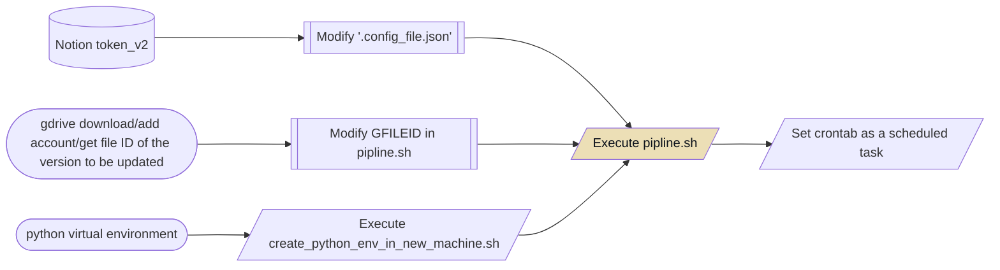

[English](./README.md) / [简体中文](./README.zh.md)

# Notion Regular Auto Backup to Google Drive

## Introduction

By using the export function of the Notion API, this pipeline saves the contents of a workspace in Notion regularly as a zip file and uploads it to Google Drive for backup. This pipeline is based on the [notion-up](https://github.com/kaedea/notion-up) project and integrates with the [gdrive v3.x](https://github.com/glotlabs/gdrive) project. There are some issues with the dump of databases, but text types are still acceptable. Currently, it only serves as a backup and there is no diff analysis. This is because the structure of my own Notion is too complicated and there is no need for analysis.

## Step by Step Guide




### Obtaining Notion token_v2

Login to your Notion account on the [notion.so](https://notion.so) website. Press F12 and find the token_v2 in the Cookies under the Applications tab.

### gdrive Environment

#### Creating Google API

Refer to [the method provided by gdrive](https://github.com/glotlabs/gdrive/blob/main/docs/create_google_api_credentials.md) for creating a Google API.

#### Adding Accounts

```shell
# Download/add account for gdrive

wget https://github.com/glotlabs/gdrive/releases/download/3.6.0/gdrive_linux-x64.tar.gz && unzip gdrive_linux-x64.tar.gz
mkdir -p /root/go/bin && mv gdrive -t /root/go/bin
/root/go/bin/gdrive account add

```

#### Obtaining ID of File to be Updated

Get the file link in Google Drive, and the string before "view" in the link is the file ID. Replace the GFILEID in pipline.sh with this ID.

For example:
```plain text
https://drive.google.com/file/d/1C1SS2Uz8WV63uQkeovpnZAI71eNrAEdV/view?usp=share_link
Here, 1C1SS2Uz8WV63uQkeovpnZAI71eNrAEdV is the file ID

```

### Setting Up Scheduled Execution

```shell
# Add a line to crontab to execute pipeline every Sunday at 3am and log the output.

0 3 * * 0 /bin/bash /xxx/notion-up/pipline.sh >> /xxx/notion-up/pipline.log 2>&1

```

## Routine Maintenance

The notion_v2 token will become invalid **every three months** and will need to be obtained again.

### Dependencies

- Notion API
    - Version changes
    - New elements' export may have formatting issues?
- Google OAuth client
    - Authorization methods may change for security reasons

## Contributions

- Notion-up - [https://github.com/kaedea/notion-up](https://github.com/kaedea/notion-up)
- Gdrive 3.x - [https://github.com/glotlabs/gdrive](https://github.com/glotlabs/gdrive)
