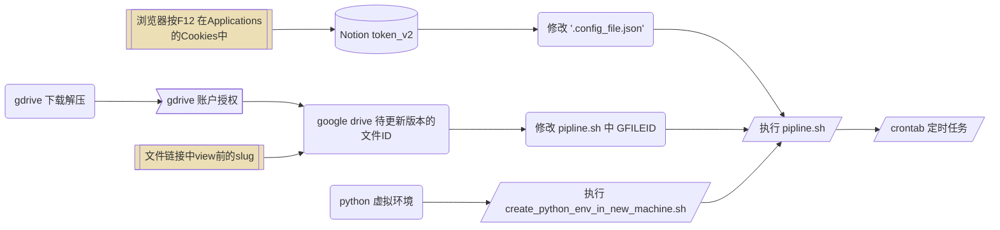

# notion 定期自动备份到 google drive

## 简介

利用 notion API 的 export 功能，将 workspace 内容定期保存为 zip 文件，并上传到 google drive 备份。
在 [notion-up](https://github.com/kaedea/notion-up) 的项目基础上，衔接 [gdrive v3.x](https://github.com/glotlabs/gdrive) 项目。
database 的 dump 有些问题，文本类尚可。
目前只是备份，没有做 diff 分析，应该也不太需要，我自己的 notion 结构太复杂，没什么分析必要。

### 从零开始的 pipline



```shell
# crontab 添加一行，每周日凌晨3点执行pipline，记录日志
0 3 * * 0 /bin/bash /xxx/notion-up/pipline.sh >> /xxx/notion-up/pipline.log 2>&1
```

## 日常维护

notion_v2 每**三个月**失效，需要再次获取

### 依赖

- notion API
    - 可能会变动
    - 新元素的export可能会有格式问题?
- google OAuth 客户端
    - 因安全性可能会更改授权方式

## 贡献

- notion-up - [https://github.com/kaedea/notion-up](https://github.com/kaedea/notion-up)
- gdrive 3.x -[https://github.com/glotlabs/gdrive](https://github.com/glotlabs/gdrive)
