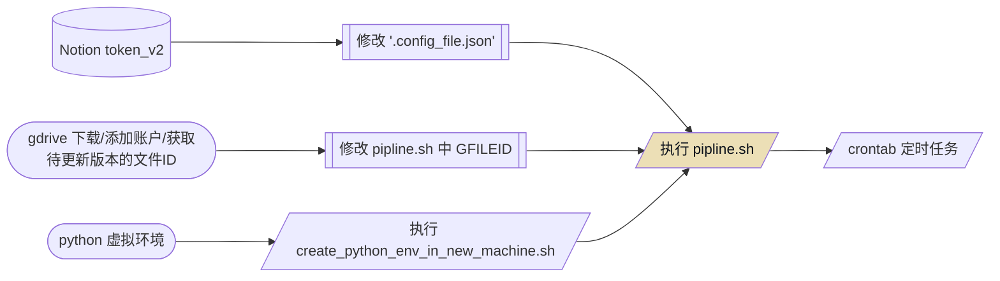

# notion 定期自动备份到 google drive

## 简介

利用 notion API 的 export 功能，将 workspace 内容定期保存为 zip 文件，并上传到 google drive 备份。
在 [notion-up](https://github.com/kaedea/notion-up) 的项目基础上，衔接 [gdrive v3.x](https://github.com/glotlabs/gdrive) 项目。
database 的 dump 有些问题，文本类尚可。
目前只是备份，没有做 diff 分析，应该也不太需要，我自己的 notion 结构太复杂，没什么分析必要。

## 从零开始的 pipline




### 获取Notion token_v2
浏览器打开 [notion.so](https://notion.so) 并登录自己账户，按F12，在Applications的Cookies中找到token_v2,

### gdrive 环境

#### 创建 Google API
见 [gdrive提供的创建方法](https://github.com/glotlabs/gdrive/blob/main/docs/create_google_api_credentials.md)

#### 添加账户

```shell
# gdrive 下载/添加账户

wget https://github.com/glotlabs/gdrive/releases/download/3.6.0/gdrive_linux-x64.tar.gz && unzip gdrive_linux-x64.tar.gz
mkdir -p /root/go/bin && mv gdrive -t /root/go/bin
/root/go/bin/gdrive account add
```

#### 待更新文件的ID

在 google drive 中获取文件链接，view 前的 slug 即为文件 ID ，将 pipline.sh 中 GFILEID 改为这串 ID

例如：
```plain text
https://drive.google.com/file/d/1C1SS2Uz8WV63uQkeovpnZAI71eNrAEdV/view?usp=share_link
这里的 1C1SS2Uz8WV63uQkeovpnZAI71eNrAEdV 是文件ID
```

### 设置定期执行

```shell
# crontab 添加一行，每周日凌晨3点执行pipline，记录日志

0 3 * * 0 /bin/bash /xxx/notion-up/pipline.sh >> /xxx/notion-up/pipline.log 2>&1
```

## 日常维护

notion_v2 每**三个月**失效，需要再次获取

### 依赖

- notion API
    - 版本变动
    - 新元素的export可能会有格式问题?
- google OAuth 客户端
    - 因安全性可能会更改授权方式

## 贡献

- notion-up - [https://github.com/kaedea/notion-up](https://github.com/kaedea/notion-up)
- gdrive 3.x -[https://github.com/glotlabs/gdrive](https://github.com/glotlabs/gdrive)
